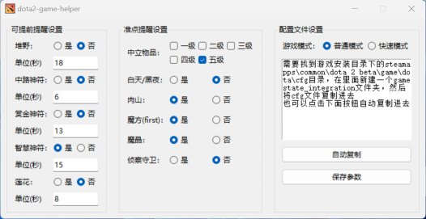

#  dota2-game-helper

### 概述
dota2-game-helper是一个基于Valve提供的GSI(游戏状态集成)能力，对游戏状态进行解析，获取游戏时钟，来通知用户即将发生的游戏事件。
> 只支持Windows 64位系统

### 功能特点
1. [x] 对于堆野、中路神符、赏金神符、智慧神符、莲花事件可以提前语音提醒
2. [x] 对于中立物品、白天/黑夜、第一次魔方刷新以及魔晶可购买事件进行语音提醒
3. [x] 针对快速模式进行优化
4. [x] 肉山重生提醒
5. [x] 当侦察守卫买完后重新上架提醒

### 使用方法
* 从发布页面下载最新版本的dota2-game-helper.exe，也可以拉取项目运行`build.py`进行编译
* 首次启动时，需要将cfg配置文件复制到dota2游戏目录`steamapps/common/dota 2 beta/game/dota/cfg/gamestate_integration`
* 目前支持版本7.39

### 注意事项
* 本工具仅作为游戏辅助，不保证能直接影响游戏结果。
* 请遵守游戏官方规定，合理使用本工具，避免任何形式的作弊行为。
* 由于游戏更新可能导致功能兼容性问题，请定期检查并更新dota2-game-helper。

* GitHub仓库：https://github.com/shizzhang0/dota2-game-helper
* 问题反馈：在GitHub仓库中创建issue，描述你遇到的问题或建议。

### 版权与许可
dota2-game-helper项目遵循[MIT](https://opensource.org/license/MIT)许可协议。你可以自由地使用、修改和分发本项目的源代码，但请遵守许可协议中的相关规定。